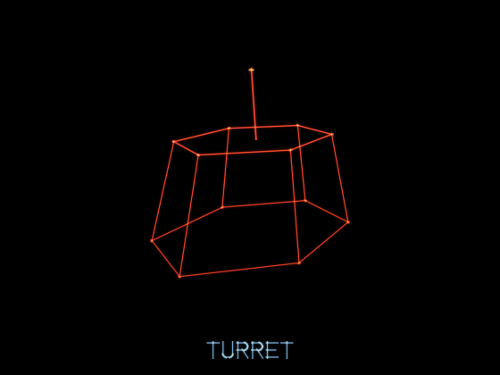
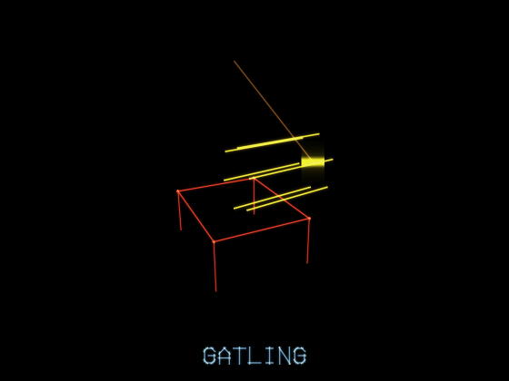
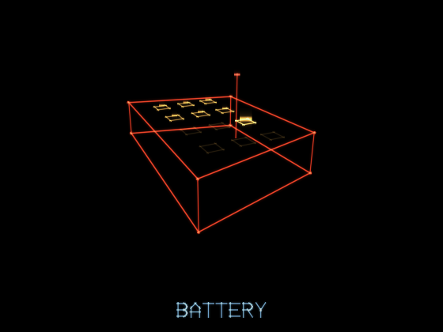
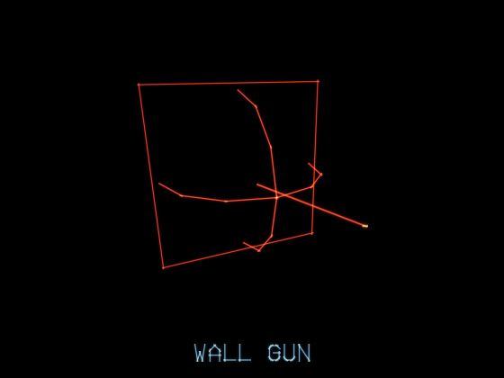
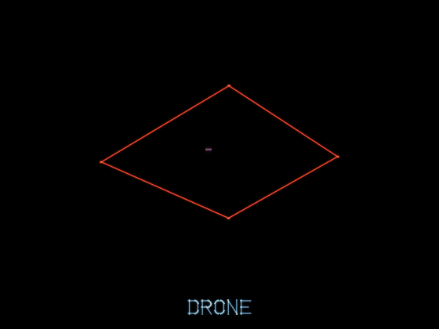
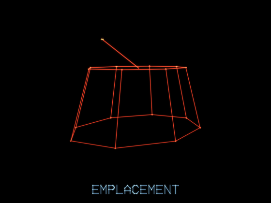
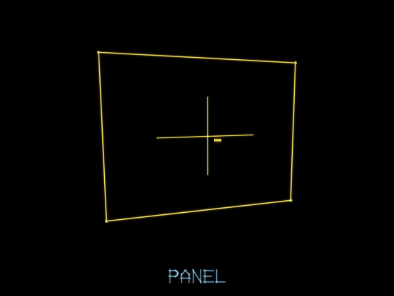
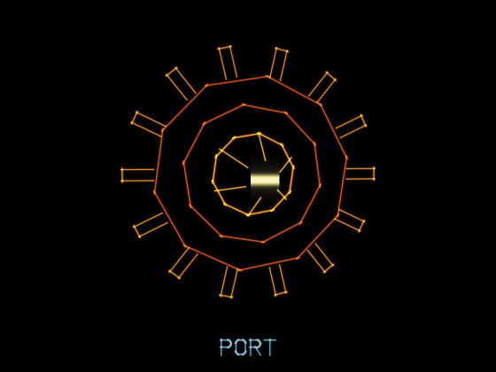
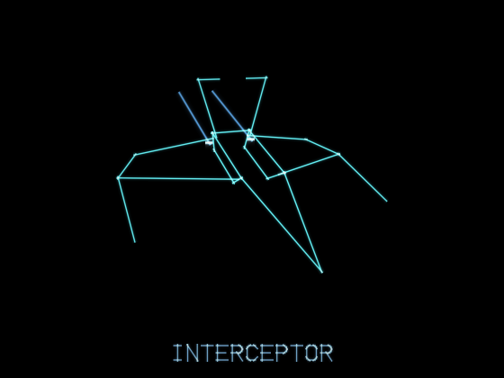

# VECTRENCH

It's not impossible. I used to bullseye womp rats in my T-16 back home, they're not much bigger than two meters!

A vector-graphics rails shooter in a canyon.  The goal of this was to experiment with games in which the level design is presented in prose.

# Flight Instructions
- Tilt the phone to move within the trench. 
- Touch anywhere to fire the machine gun.
- Paint your targets and launch missiles all at once.
- Hold **ROLL** to turn the ship on its edge, and fit through the upright slits.
- **BURN** for a second and a half of speed, on a long cooldown. Green hexagons
  give you one free — take one while already burning and it goes super.
- Stay below the rim of the canyon, or you'll be womp rat meat

**[Play it](https://cfreder2.github.io/VECTRENCH/)**

## Running it locally

It is a static page with no build step and no dependencies. Serve the directory
over HTTP (ES modules do not load from `file://`) and open it:

```bash
git clone https://github.com/cfreder2/VECTRENCH.git
cd VECTRENCH
python3 -m http.server 8000     # or: npx http-server -p 8000
```

Then open `http://<your-machine>:8000/` on the phone. Tap **TAP TO BEGIN** — that
first gesture is what lets the browser grant motion access and start audio, both
of which require a user gesture. Use **CALIBRATE TILT** while holding the phone
the way you intend to play; that posture becomes neutral.

**Tilt is relative, not absolute.** Neutral is whatever posture you are holding
when a run starts — there is no "upright", and lying on your back works as well
as sitting up. The game takes that neutral as soon as the phone is *still*
rather than the instant you press FLY IT, because pressing FLY IT is also when
it asks for landscape and half the time you are mid-turn; it shows **HOLD THE
PHONE STEADY** until it has one. **CALIBRATE TILT** on the setup panel re-takes
it whenever you want.

What is measured is the *angle* the phone has turned from that neutral, not how
much gravity has shifted along the screen. Those are the same thing near flat
and nothing like it once the phone is tipped up: gravity has a fixed length, so
its up-the-screen component runs out, and held upright it stops responding
entirely -- tipping the top toward you and away from you both shrink it, so the
climb simply is not there. Reading the angle instead means a posture is a
posture, and holding the phone near-vertical flies exactly like holding it
flat.

No tilt sensor, or permission denied? Drag one finger to steer and touch with a
second to fire. On a desktop, arrow keys or WASD steer, click or SPACE fires, and
SHIFT or M launches.

## Making a level

**[docs/LEVELS.md](docs/LEVELS.md) is the full authoring guide** — the whole prose
vocabulary, every spec field and its range, the rules the compiler enforces, and
how to add a level of your own to the game. What follows is the short version.

### Describing one

Type a description and press **BUILD**. Prose is split on sequence markers
("then", "after that", "finally") and each segment becomes one section of the
run, flown in order. So:

> Start wide and open, then tighten into a deep twisting trench packed with
> hanging fangs and irises, seal it twice with heavy turret cover on the
> surface, finish with a narrow choke and an exhaust port.

The vocabulary covers width (`tight`, `cavernous`, `claustrophobic`), depth
(`shallow`, `bottomless chasm`), turning (`straight`, `serpentine`, `hairpin`),
relief (`flat`, `rolling`, `hilly`), density (`sparse`, `wall to wall`),
obstacles (`columns`, `stalactites`, `bulkheads`, `irises`, `staggered slabs`),
enemies (`turrets`, `wall guns`, `drones`), bulkheads (`sealed three times`),
speed (`ludicrous speed`), colour (`molten red`, `icy blue`, `toxic green`), and
length (`short`, `long`, `for 2000 units`). Intensifiers work: `very tight` is
tighter than `tight`. Explicit numbers win over adjectives.

**BUILD** shows you what it understood and, below the plan and elevation
schematic, what it actually placed. **SCHEMATIC** collapses the panel so you can
study the whole run before flying it. **RESEED** keeps the shape and re-rolls
placement. **COPY LINK** puts the entire level in the URL, so a level is a link.

### Writing one by hand

Prose is a way in, not the format. A level is a spec — plain JSON, every field
clamped — and you can write one directly instead:

```bash
$EDITOR levels/my-level.json     # copy one of the three and change numbers
node tools/levels.mjs --sync     # compile levels/ into src/levels.js
node tools/levels.mjs            # prove it is flyable, print its share link
```

It then appears as a button in the game alongside the other three.
[docs/LEVELS.md](docs/LEVELS.md#2-write-the-spec) documents every field.

### Designing one with Claude

Levels are described in prose and written by an agent. There is no vocabulary
to learn, and there is no API key: it runs `claude` on your own machine, on the
subscription you already have.

```bash
node tools/serve.mjs            # http://localhost:8000/
```

Open that (from your phone, use this machine's address on the network), type
what you want into **DESIGN A NEW LEVEL**, and wait a minute or two. The agent
reads [docs/LEVELS.md](docs/LEVELS.md), writes the spec, runs the same
flyability gate the shipped levels pass, and fixes whatever failed. When it
passes, the level appears on the shelf and the file is in `levels/custom/`.

> A frozen cathedral of ice. Start enormous and wide and shallow, almost
> straight, with towering spires and swarms of drones. Then it narrows into a
> long twisting tunnel packed with irises and crushers, sealed twice, wall guns
> everywhere. Pale blue and cold. Finish with a tight choke and an exhaust port.

That took 84 seconds and came back as a 6-section, 87-second level: a width-125
shallow nave thick with drones, narrowing to a width-46 crawl of rings and
crushers, sealed twice, in pale blue.

**This only works locally.** [The published page](https://cfreder2.github.io/VECTRENCH/)
has no server behind it, so it has the pre-built levels and nothing else, and
the design button says as much. That is the intended shape: the game is a static
page, and authoring is a thing you run at home.

## What is in the canyon

**[docs/BESTIARY.md](docs/BESTIARY.md) is the reference** — every enemy, every
obstacle and the ship, each with a picture, what it does, and every number that
decides how it behaves. The pictures in it are rendered from the game's own draw
code by `tools/portraits.mjs`, so they cannot go stale.

The name in `code` is what a level actually places. There are eight things that
shoot at you, or are shot:

| | Name | `kind` | What it does |
| --- | --- | --- | --- |
|  | **Turret** | `turret` | A hexagonal drum on the surface. Fires **only at a ship that has broken the rim**. 3 hp |
|  | **Gatling** | `gatling` | Six barrels near the lip. Spins up for 0.55s in plain sight — the only warning — then 25 rounds a second. 5 hp |
|  | **Battery** | `battery` | A missile deck with 2 to 12 launch cells, emptied one tube at a time. The missiles out-run you, but they can be shot down. 6–16 hp |
|  | **Wall gun** | `wallgun` | A dome on the trench wall. The mirror of the surface guns: it fires **only at a ship that stayed low**. 2 hp |
|  | **Drone** | `drone` | The only enemy that moves. Comes in waves of one to three, weaving, closing at 58% of your speed. 2 hp |
|  | **Emplacement** | `emplacement` | The turret's big brother, standing *inside* the trench. Two per level, before the port, and altitude does not save you. 14 hp |
|  | **Panel** | `panel` | Not a gun — a switch on a bulkhead's face. Shoot every one and the bulkhead sinks instead of making you climb. 2 hp |
|  | **Port** | `port` | The finale. Guns will not breach it; it has to be painted and hit with a missile |

All of them are the same red-orange, which is the whole colour language: warm
means it shoots or it is rock, cool blue means machinery that only crushes you,
green means the one thing out there that helps.

And the ship:

| | Name | |
| --- | --- | --- |
|  | **Interceptor** | 100 shields, regenerating only below the rim. A cannon that overheats in 2.6 seconds of held fire, and eight missile locks that are free to fire and bought by flying |

The obstacles — `pylon`, `fang`, `gate`, `slot`, `ring`, `boostgate`, `stack`,
`press`, `slider`, `cross`, `pinwheel` and the `seal` bulkheads — have no hit
points and cannot be shot. They are pictured and described in
[the bestiary](docs/BESTIARY.md#obstacles) too.

## How it fits together

```
prose ──> claude, on your machine ──> levels/custom/*.json ──┐
                                                            ├──> spec (JSON) ──> track.js ──> geometry
levels/*.json (hand-tuned, shipped) ────────────────────────┘        │          level.js ──> obstacles, enemies, port
                                                                     └──> URL hash, so a spec still loads from a link
```

The spec is the contract. Everything upstream of it is a front-end, everything
downstream consumes it, and `spec.js` clamps every field — so a spec from a link,
an agent, or a typo can be strange but never unplayable.

| File | Owns |
| --- | --- |
| `spec.js` | The level spec: fields, ranges, clamping, URL encoding |
| `levels.js` | The pre-built levels. Generated from `levels/*.json` — do not edit |
| `track.js` | Spec → canyon geometry; the rail, widths, rim heights |
| `level.js` | Spec → obstacles, guns, drone waves, the port |
| `terrain.js` | Drawing the canyon |
| `entities.js` | Ship, obstacles, enemies, projectiles, particles |
| `game.js` | Physics, camera, collision, enemy fire, both weapons, scoring |
| `collide.js` | Swept segment-sphere tests, and the moving-obstacle transform |
| `renderer.js` | The vector display: batched glowing lines, phosphor trails |
| `hud.js` | HUD and the level schematic |
| `font.js` | Stroke font |
| `input.js` | Tilt, touch, keyboard |
| `audio.js` | Synthesised sound, no samples |
| `music.js` | Flight of the Bumblebee, played on square waves |
| `ui.js` | Screens and the authoring panel |
| `main.js` | Bootstrap and the frame loop |

Outside `src/`: `tools/serve.mjs` is the local server — it serves the game and
runs the design agent. `tools/levels.mjs` compiles and checks levels; run it
with a path to check one file. `tools/portraits.mjs` re-renders
[the bestiary's](docs/BESTIARY.md) pictures — it reimplements the vector display
in software, so it can call the real `entities.js` draw code with no browser and
write PNGs.

Outside `src/`: [`levels/`](levels) holds the pre-built levels as plain spec
JSON — the source of truth for them — and `tools/levels.mjs` compiles that
directory into `src/levels.js`, because the single-file build has no directory
to read at runtime.

### Rendering

Everything visible is a glowing line segment. Segments are transformed and
near-clipped on the CPU, emitted as screen-space quads into one buffer, and drawn
in a single additive pass. Additive blending is order-independent, so there is no
depth buffer and no sorting. The scene renders into a framebuffer that is only
partly faded each frame; that leftover light is the phosphor trail, and it does
most of the work of selling speed.

Wireframe has no occlusion, so the surface deck is faded by altitude: below the
rim you cannot see the plane a solid renderer would hide behind rock, and
breaking the rim reveals it.

## Testing

`tools/audit.mjs` is a fairness check, not a smoke test: it walks a compiled
level and runs a reachability search over the trench cross-section at each
obstacle, using the ship's real lateral and vertical speed limits, to prove a
flyable line exists. Run it over a spread of seeds before changing the generator.

```bash
node tools/audit.mjs            # clearability across the prose examples and 60 seeds
node tools/levels.mjs           # the same proof over each pre-built level, plus 40 reseeds
node tools/levels.mjs --check   # src/levels.js still matches levels/*.json
node tools/doccheck.mjs         # the docs still describe the code
```

The second one is the gate on a pre-built level. It checks four things and exits
non-zero on any of them:

- a flyable line exists on the shipped seed, and under 40 **other** seeds too,
  because **RESEED** re-rolls the seed in play — a shape that is only clearable
  on the seed it shipped with is a shape that will betray somebody
- the level takes between 60 and 135 seconds to fly
- every authored bulkhead actually got placed (the compiler caps them at one per
  2600 units of section)
- `src/levels.js` still matches `levels/*.json`

The reachability search runs against `MAX_VX` and `MAX_VY` imported from
`game.js` rather than copies, so making the ship faster re-proves the levels
instead of quietly invalidating the proof.

## Single-file build

`dist/vectrench.html` is the whole game inlined into one file — open it directly
from disk, no server needed. Rebuild it after changing anything under `src/`:

```bash
node tools/levels.mjs --sync    # only if levels/*.json changed
node tools/bundle.mjs
```

The bundler is a concatenator, not a real bundler: it emits the modules in
dependency order into one scope with imports and exports stripped. It aborts if
two modules declare the same top-level name, so the shortcut stays honest.

One thing in it is load-order-sensitive rather than merely tidy, and it would
fail silently if reordered: `game.js` reads `CANYON` from `terrain.js` at
definition time, and top-level `const` is not hoisted.
