# The Bestiary

Everything in the canyon that is not rock: what it is called, what it looks
like, what it does to you, and every number that decides how it behaves.

Each picture is rendered by `tools/portraits.mjs`, which imports `drawEnemies`,
`drawObstacles` and `drawShip` straight out of [`src/entities.js`](../src/entities.js)
and points a camera at them. Nothing here is drawn by hand, so nothing here can
quietly stop being true — change a shape and re-run it:

```bash
node tools/portraits.mjs          # all of them, into docs/assets/
node tools/portraits.mjs turret   # just the ones whose id matches
```

---

## The roster

**Bad guys** — things with hit points, which shoot at you, which you can shoot
and lock. The name in `code` is the `kind` string. That string is the identity:
`level.js` places on it, `game.js` picks a firing routine on it, `entities.js`
picks a shape on it. Nothing else is the name.

| | Name | `kind` | Lives | Fires | Spawned by |
| --- | --- | --- | --- | --- | --- |
|  | **Turret** | `turret` | On the rim | Only when you break the rim | `turrets` |
|  | **Gatling** | `gatling` | On the rim, near the lip | Spins up, then a stream | `gatlings` |
|  | **Battery** | `battery` | On the rim, set back | A rack of homing missiles | `batteries` |
|  | **Wall gun** | `wallgun` | On the trench wall | Only when you stay *low* | `wallguns` |
|  | **Drone** | `drone` | In the trench, moving | Closes and shoots | `drones` |
|  | **Emplacement** | `emplacement` | In the trench, near the port | Always | automatic, before the port |
|  | **Panel** | `panel` | On a bulkhead face | Never — it is a switch | `panels`, per `seals` |
|  | **Port** | `port` | The end of the run | Only if the level arms it | `finale: "port"`, `armedPort` |

**The ship** — the only thing on your side.

| | Name | Notes |
| --- | --- | --- |
|  | **Interceptor** | One hull, two wingtip cannons, eight missile locks |

**Obstacles** — no hit points, cannot be shot, cannot be locked. You fly around
them or you do not. They are listed in full [further down](#obstacles).

`pylon` · `fang` · `gate` · `slot` · `ring` · `boostgate` · `stack` · `press` ·
`slider` · `cross` · `pinwheel` · `seal`

---

## How a bad guy is put together

Every enemy is one object, built by the same factory in
[`level.js`](../src/level.js), and every field on it is an argument you can set
per instance:

```js
enemy('turret', t, x, y, { hp: 3, maxHp: 3, lockable: true, points: 250, cool: 0.6 })
```

### Fields every enemy has

| Field | Type | What it means |
| --- | --- | --- |
| `kind` | string | Which one it is. Drives shape, firing routine, hit radius, everything |
| `t` | units | Where along the track it stands. 0 is the start line |
| `x` | units | Across the trench. 0 is the centre line, negative is one wall, positive the other. Beyond `±halfWidth` is on the surface |
| `y` | units | Height above the trench floor. `rim` is the lip |
| `hp` / `maxHp` | number | Gun hits to kill — the cannons do exactly 1 each. A missile does **8**, so anything above that takes two, or one and a few seconds of the gun |
| `points` | number | Score for killing it |
| `cool` | seconds | Time until it may fire again. Set at build time so a cluster does not fire in lockstep |
| `lockable` | bool | Whether the crosshair can paint it. False means missiles will not go near it |
| `alive` | bool | Cleared on death; a dead enemy is skipped, not removed |
| `aim`, `spin`, `flash` | — | Written every frame. Barrel angle, idle rotation, white hit-flash |
| `los` | 0–1 | How much of it the rock is *not* hiding. Faded rather than culled, so breaking the rim is a reveal |
| `world` | vec3 | Cached world position, written by the targeting pass |

### Size and colour are not arguments

Two things you might expect to be tunable are not, on purpose.

**Size** is baked into each draw function — a turret's drum is `R = 9`, an
emplacement's is `R = 17`, a wall gun's plate is `R = 9`. The one exception is
the battery, which is genuinely sized by its `tubes` count, because how big it
looks on the skyline *is* the warning about how much is about to be fired at
you.

**Colour** is derived, never authored. Every gun runs through one line in
[`entities.js`](../src/entities.js):

```js
hsv(0.02 + hurt * 0.02, 0.85 - flash * 0.85, 1, col)
```

so all of them are the same hostile red-orange, they shift as they take damage
(`hurt = 1 - hp / maxHp`), and they go white for a frame when hit. That is the
whole colour language: **red-orange is a thing that shoots**, cool blue is
machinery that only crushes you, green is the one thing that helps. A section's
`hue` field colours the *canyon*, not the things standing on it.

---

## The bad guys

### Turret — `turret`


A hexagonal drum on the surface with a short barrel that swings to track you.
The plainest thing in the game, and the most numerous. It **only fires at a ship
that has broken the rim**, which is the deal the whole level is built on: the
trench is cover, and the moment you climb out of it the skyline answers.

| Argument | Value | Meaning |
| --- | --- | --- |
| `hp` | 3 | Three cannon hits |
| `points` | 250 | |
| shape | 6-sided drum, R 9, 8 tall | It has *height*: drawn as one flat ring it was a horizontal disc, and you fight these from the rim looking along the surface, where a horizontal disc is a line |
| `cool` | `0.6 + rand()` | Initial delay, so a row of them staggers |
| reload | 0.85 s × 0.75–1.35 | Jittered per shot |
| bolt speed | 520 u/s | Leads your ship by 0.85 of its velocity |
| damage | 12 | Of 100 shields |
| engages | `exposed`, ahead < 940, behind > −60 | |
| hit radius | 13 | |
| shape | `R = 9`, 6 sides | Barrel reaches `R * 1.1` |

**Placement.** Density `turrets` (0–1, default 0.42) → one every
`1750 / (0.12 + turrets * 4.2)` units. Stands at `x = ±(halfWidth + 24 + rand() * 200)`,
`y = rim`. Every bulkhead additionally pulls 3–5 of them to within ±450 units,
as cover fire for the climb it forces.

---

### Gatling — `gatling`


A six-barrel rotary cannon on a box mount, sitting close to the lip. It **spins
up in plain sight before it fires** — the barrels turn faster, the muzzle
brightens, hot air rises off it — and that 0.55 seconds is the only warning you
get. It is deliberately long enough to duck back under the rim, which is the
decision the surface exists to keep asking. Individual rounds are cheap;
standing in the stream is not.

| Argument | Value | Meaning |
| --- | --- | --- |
| `hp` | 5 | |
| `points` | 400 | |
| `wind` | 0–1 | Spin-up state. Climbs at `1 / 0.55` per second while it wants to fire, falls at 1.1 |
| `barrel` | radians | Barrel rotation, `2 + wind * 26` rad/s — the visible tell |
| cadence | 0.04 s | 25 rounds a second, once wound |
| bolt speed | 700 u/s | Drawn long and pale as tracer |
| damage | 6 | Per round |
| spread | 0.78 | Scatter, so the stream connects without being hitscan |
| engages | `exposed`, ahead < 1020, behind > −160 | |
| shape | mount 18 × 14 × 7, 6 barrels at `R = 5.2`, reach 15 | |

**Placement.** Density `gatlings` (default 0.32) → one every
`1900 / (0.12 + gatlings * 5.0)` units, at `x = ±(halfWidth + 18 + rand() * 90)`,
`y = rim`. Close to the lip on purpose: its job is to make the seconds above the
rim expensive, not to snipe. **Every bulkhead gets one of its own.**

---

### Battery — `battery`


A missile deck: a chamfered hull on the skyline with a grid of vertical launch
cells in it, one per tube, a lit cell for every missile still loaded and a mast
so it has a silhouette at distance. It empties the whole rack at you one tube at
a time, 0.11 seconds apart, so twelve missiles arrive as a stream you have to
keep answering rather than one wall you either dodge or do not.

The missiles are heat-seekers that out-run the ship. They can be **shot down**
(+40 each) and they **die on rock**, so a rack emptied at you has several
answers — none of which is outflying it.

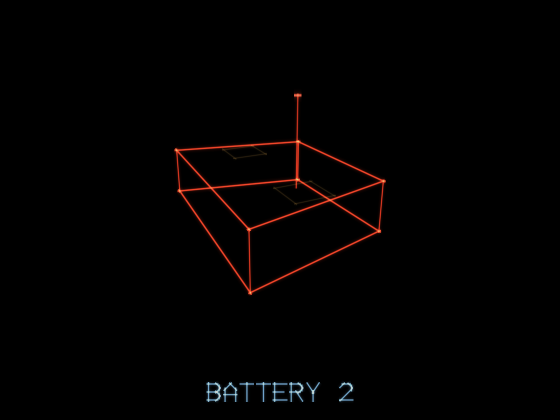

*The two-tube version. Same object, different `tubes`, and the deck grows with it.*

| Argument | Value | Meaning |
| --- | --- | --- |
| `tubes` | 2, 4, 6, 8 or 12 | Missiles per rack. Also sets hull length, deck width, mast height |
| `hp` | `4 + tubes` | 6 to 16 |
| `points` | `300 + tubes * 120` | 540 to 1740 |
| `salvo` | int | Tubes left in the current rack. Non-zero means mid-launch and it will finish regardless of what you do |
| `salvoTimer` | seconds | 0.11 between tubes |
| reload | 3.2 s × 0.85–1.25 | After a rack empties |
| engages | `exposed`, ahead < 1600, behind > −420 | The longest reach of anything |
| ≥ 6 tubes | alarm + "`N` INBOUND" | |

**The missile** (`fireSeeker`): launches at 300 u/s straight up out of the cell,
accelerates at 265 to a top speed of **640**, turn rate 2.05 rad/s, 7-second
life, 0.35 s before it arms. Damage **26**. It is faster than you and slower to
turn than you, so it is beaten by flying, not by running.

**Placement.** Density `batteries` (default 0.28) → one every
`2300 / (0.12 + batteries * 4.0)` units, at `x = ±(halfWidth + 34 + rand() * 150)`,
`y = rim`. The section's `batteries` value *also* decides how big each one is —
`batterySize()` rolls `rand() * (0.8 + menace * 1.1)` and steps 12 / 8 / 6 / 4 /
2 — so a heavy section is where the twelve-tube ones live. Every bulkhead gets
one, rolled at a raised menace of `0.55 + batteries * 0.45`.

---

### Wall gun — `wallgun`


A plate bolted flush to the trench wall with a dome bulging out of it and a
barrel out of the dome. It is the mirror image of everything on the surface: it
**only fires at a ship that is still down in the trench**. Between the wall guns
below and the batteries above there is no altitude that is free.

| Argument | Value | Meaning |
| --- | --- | --- |
| `hp` | 2 | The most fragile gun |
| `points` | 120 | |
| `cool` | `1 + rand() * 1.4` | |
| reload | 1.7 s × 0.75–1.35 | The slowest of the light guns |
| bolt speed | 520 u/s | |
| damage | 12 | |
| engages | **not** `exposed`, ahead < 620, behind > 30 | Short reach |
| hit radius | 11 | |
| shape | plate `R = 9`, dome 0.92 R, barrel to 1.9 R | Dome faces the trench centre |

**Placement.** Density `wallguns` (default 0.32) → one every
`2600 / (0.12 + wallguns * 6.5)` units, mounted at `x = ±(halfWidth − 4)`,
`y = 22 + rand() * (rim − 40)` — anywhere up the wall. Suppressed within 220
units of a bulkhead, where the fight is supposed to be overhead.

---

### Drone — `drone`


The only enemy that moves. A blunt delta with a bright core, spawned in waves
ahead of you, weaving as it comes. It advances **at 42% of your speed** — which
means it is closing at 58% of it, and a wave you ignore arrives whether or not
you were interested.

| Argument | Value | Meaning |
| --- | --- | --- |
| `hp` | 2 | |
| `points` | 200 | |
| `cool` | `0.7 + h * 1.1` | Hashed off the wave, so a trio does not volley |
| reload | 1.5 s × 0.75–1.35 | |
| bolt speed | 520 u/s | |
| damage | 12 | |
| engages | ahead < 520, behind > 20 | Regardless of your altitude |
| advance | `speed * 0.42` | |
| weave | ±46 u/s across, ±34 u/s vertical, `phase` at 1.7 rad/s | Clamped inside the trench |
| hit radius | 11 | |
| shape | delta, `R = 8` | |

**Placement.** Density `drones` (default 0.3) → a wave every
`2800 / (0.12 + drones * 2.6)` units. Each wave is **1–3 drones**, 34 units
apart, spawned when you are within 950 units and cleared 90 units behind you.

---

### Emplacement — `emplacement`

**The one thing a single lock will not kill.** That is the whole point of it:
killing outright meant it died 697 units out, having fired eight shells from
maximum range and landed none of them — not a threat, because it was never
alive while you were close. Spend the second missile, or finish it with the gun,
or accept the 19 damage it does to you on the way past.


The turret's big brother: eight sides instead of six, nearly twice the radius,
and it stands *inside* the trench at half rim height rather than on the surface.
There are exactly two per level and you cannot author them — they are placed
1750 and 1050 units before the port, to teach you the missile lock while it is
still only expensive to get wrong.

| Argument | Value | Meaning |
| --- | --- | --- |
| `hp` | 14 | Fourteen cannon hits, or **two missiles** — or one missile and six cannon hits. It is the only thing in the trench that survives a lock |
| fire | 3 heavy shells 0.17 s apart, then 1.15 s | 19 each, at 560 u/s |
| missile | one per pass, from 560 units | 26. Slower and blunter than a battery's — a trench is not open air |
| shape | 8-sided drum, R 17, 15 tall | Mounted on a wall rather than standing on the floor, so it is drawn lying on its side with the wide base against the rock and the barrel across the trench |
| `points` | 900 | |
| `cool` | 1.2 | |
| reload | 1.5 s × 0.75–1.35 | |
| bolt speed | 420 u/s | `heavy` — slower, fatter, drawn thick |
| damage | **19** | |
| engages | ahead < 900, behind > −40 | **Always.** Altitude does not help |
| hit radius | 21 | |
| shape | `R = 17`, 8 sides | Death is a big boom and a screen shake |

**Placement.** Automatic when `finale` is `"port"`, at `portT − 1750` and
`portT − 1050`, `x = ±(halfWidth − 14)`, `y = rim * 0.5`.

---

### Panel — `panel`


Not a gun — a switch. A small bright yellow plate on the face of a bulkhead,
pulsing. Shoot every panel on one bulkhead and it sinks into the floor and you
keep your altitude. That is what makes a bulkhead a decision rather than a toll:
climb into the guns waiting on the surface, or stay low and spend the time and
the fire it takes to open it. A bulkhead authored with `panels: 0` is welded
shut and the only way is over the top.

| Argument | Value | Meaning |
| --- | --- | --- |
| `hp` | 2 | |
| `points` | 200 | Plus 800 for the bulkhead when the last one goes |
| `cool` | `1e9` | It never fires |
| `sealT` | units | Which bulkhead it belongs to |
| `lockable` | true | Missiles work, and a four-panel bulkhead is four locks |
| shape | 18 × 14 plate, cross, centre dot | Goes red when hit |

**Placement.** `panels` per section (0–4, default 2), laid out as a grid on the
face at `t − 3`: columns at `x = (−0.3 + 0.6c/(cols−1)) * halfWidth`, rows at
`y = rim * (0.34 + 0.3r)`.

---

### Port — `port`


The finale. A recessed exhaust vent: three counter-rotating rings, six spokes
running back into the shaft, fourteen short shafts standing around the rim, and
a live core. **Guns will not breach it** — a laser hit says so and bounces. It
has to be painted and hit with a missile, which is the one moment the game asks
for the other weapon.

**It can be armed.** `"armedPort": true` at the top level of a spec turns those
fourteen shafts into guns: they fire one after another around the ring — the
port does not turn, the firing does — and each beam hangs in the 340 units in
front of it, fading orange to yellow. Nine stand at once, so five shafts are
always dark and there is a gap running round the wall at about 154°. The beams
start at the shaft mouths rather than at the middle, so the port's own axis is
the eye of it: hold that line and the wall turns around you for nothing, drift
thirty units off it and it costs about half a shield on the way in. **Off unless
a level asks** — an exhaust port is a thing you shoot, not a thing that shoots.

| Argument | Value | Meaning |
| --- | --- | --- |
| `hp` | 1 | To a missile. Immune to cannon fire entirely |
| `points` | 5000 | Plus 5000 for the win |
| `spin` | 0.9 rad/s | Faster than anything else's idle spin |
| hit radius | 20 | |
| shape | rings at `R = 13, 22, 31`, shafts from 31 to 40 | |
| armed | `armedPort`, default off. 16 damage a beam, 0.13 s apart |

**Placement.** `finale: "port"` puts it at the end of the track, `y = rim * 0.44`.
Nothing else is placed in the last 620 units, and no bulkhead within 1200.

---

## The music

One theme per level, named by the spec's `music` field and written in
[`src/songs.js`](../src/songs.js). The synth is the NES's set and not by
accident — two pulse voices, a triangle and noise — which is the palette every
stage theme of that era was written for. What made those sound bigger than four
channels was technique, and it is the technique that is implemented here rather
than more voices:

| | |
| --- | --- |
| **arpeggio** | a chord is one voice cycling three notes faster than the ear separates them. One channel instead of three, and it is where the shimmer comes from |
| **vibrato** | anything held longer than a quarter of a second wavers, delayed slightly the way a player would. A held note that does not is a test tone |
| **a second pulse** | harmony under the lead, quieter and duller, so two channels read as one instrument thickening |
| **a walking bass** | roots on the beat is a metronome; a bass that moves is a part |
| **per-song mix** | the balance is part of the writing. A theme carried by its bass and one carried by its lead do not want the same one |

| Song | | |
| --- | --- | --- |
| `bumblebee` | 160bpm, 2/4 | Rimsky-Korsakov at the score's tempo. No arpeggio — the lead never stops long enough for one |
| `water` | 132bpm, A minor | i–VI–v–III–V7–iv–V7 over a running sixteenth arpeggio. Eight bars that sink for four and climb back out for four. Long held notes, vibrato, the bass out of the way |
| `fire` | 172bpm, E minor | The opposite choice in every respect: hammered rather than flowing, stabs rather than song, four on the floor. Its dominant is a **B7**, which carries a D♯ — the raised seventh of the harmonic minor, a semitone off the tonic and unwilling to sit still. That one note is what makes a stage sound hot rather than merely dark |

Both written ones are checked as music before anyone hears them: every bar the
right length, the lead inside a singing octave, and the strong beats landing on
chord tones — 53% for `water`, which floats, and 87% for `fire`, which does not.
That check caught two wrong chords in `water`, one of them a tritone.

## The ship

### Interceptor


<table><tr><td width="50%">

Drawn as a silhouette rather than a model, because you see it from behind at
about fifty pixels tall: a hull, two swept wings, a cannon on each wingtip, two
fins, and an engine flare whose length tracks the throttle.

</td><td>

| | |
| --- | --- |
| Shields | 100, regenerating 7.5/s below the rim after 3 clean seconds |
| Hull | 14 wide × 10 tall (`SHIP_HX/HY`), 5 × 18 on edge (`KNIFE_HX/HY`). What it is at any moment comes from \|sin\| of the roll angle, so it is thinnest a quarter turn round either way and back to normal at a half turn |
| Lateral | 145 u/s |
| Vertical | 160 u/s — faster, because the climb is what kills you |

</td></tr></table>

| Weapon | Numbers |
| --- | --- |
| **Cannon** | 0.09 s cadence, 1500 u/s, 1 damage. Heat 0.38/s up, 0.5/s down; overheats at 1 and will not fire again until 0.25 |
| **Missiles** | Up to **8** locks, 5 s cooldown, 620 u/s, **8 damage** — which kills everything light outright and leaves the heavies standing. Free to fire — you buy them by flying, since painting means holding the crosshair on a target for 0.24 s |
| **Roll** | A double tap with the second tap held down — there is no roll button, because a button in a fixed corner cannot say *which way*. The roll starts on the press rather than once the hold has proved itself: 7.5 rad/s, on edge in about 150ms. 7.5 rad/s onto its edge, trading 14×10 for 5×18 — width for height. **Signed**: it goes over to whichever side you asked for, because rolling only ever one way is no use when the thing you are avoiding is on that side |
| **Barrel roll** | A double tap let go of. A whole turn at 11 rad/s, about half a second, at a steady rate rather than easing out — and it is a *dodge*: 165 u/s sideways while it goes round, so it moves the ship and not only the model. It passes through the knife edge twice on the way |
| **Burn** | Held. 1.5× for as long as the button is down and the tank has charge: 2.4 s of it, refilling over 8 s, and letting go early keeps what is left. Run it dry and it latches off until you release. Both it and gate time spool in and out rather than switching |
| **Gate time** | A separate 1.5× that a turbo gate grants for 3 s and stacks. Independent of the tank in both directions. Burning *and* gated is 2.1× |

The crosshair is not aimed. It sits where the nose points, and the nose yaws up
to 0.52 rad with your steering — so *flying* is how you put it on things, and a
lock is bought with flight path.

**PAINT TO LOCK**, on by default, decides how much of that is required. On, a
target paints only while it is inside the drawn brackets — what you see is what
you paint. Off, anything within 108 scale units paints, which is a quarter of
the screen's short side, and pointing the ship down the canyon paints most of
what is in front of it: it plays as an auto-lock. Measured over a run with a
pilot who never aims, strict paints 0.70 targets in an average frame against
1.81 loose.

**Line of sight is real.** A surface gun cannot be seen, painted or locked from
the trench floor: the sight line clips the rim. Fighting the surface means
climbing into its fire.

---

## Aim, and what speed buys you

Every gun that throws a shell -- turret, gatling, wall gun, drone, emplacement --
lays each shot either properly or deliberately wide, and how often it manages
the first is what boosting changes:

| You are | Shots laid properly |
| --- | --- |
| flying normally | **80%** |
| burning, or gated (1.5×) | **60%** |
| both at once (2.1×) | **50%** |

A shot laid properly *solves* the intercept — where the ship will be when the
shell gets there, given its whole velocity — rather than aiming at where it is
now. A thrown one goes wide **across** the line of fire rather than short,
because a shell that lands behind you reads as the gun being slow and one past
your wing reads as the gun missing.

Even a proper shot is not a perfect one. Its error grows with the shell's flight
time — 6 units at the muzzle, 110 more for every second in the air — which is
what a gunner's error actually does: a shot across the trench is nearly certain
and one at the far end of its range is a guess. Solving the intercept exactly
and leaving it at that made every gun a marksman, 44% of shots landing where
15% had, and the whole game twice as lethal.

Shells fly faster in proportion to the boost, too, which is arithmetic rather
than flavour: at 2.1× the ship was outrunning a 520 u/s shell and one per cent
of them landed.

| Above the rim, same line | Damage a second | Shots that land |
| --- | --- | --- |
| not boosting | 26.8 | 24% |
| burning | 13.1 | 27% |
| super burn | 5.9 | 23% |

The fraction landing barely moves — the geometry is fair at any speed now. What
speed buys is *fewer shots fired at you*, because you spend less time inside each
gun's reach. It used to buy immunity: 0.2 damage a second and one shot in a
hundred.

## What hurts, and how much

| Source | Damage |
| --- | --- |
| Gatling tracer | 6 |
| Turret / wall gun / drone bolt | 12 |
| Emplacement bolt (`heavy`) | 19 |
| Battery seeker | 26 |
| Ring beam | 20 |
| Port beam (armed ports only) | 16 |
| Hitting any obstacle | 34 |
| Hitting a bulkhead | 48 |
| Shields | 100, +7.5/s below the rim after 3 seconds without a hit |

---

## Obstacles

No hit points. They cannot be shot, painted or locked — they are the part of a
level you fly *around*, not the part you answer. Which kinds may appear in a
section is the `kinds` list; how often is `obstacles` (0–1), which spaces them
every `2500 / (0.12 + obstacles * 6.2)` units with a hard floor of 240 between
any two.

Colour is the tell: **warm orange is rock**, cool blue is machinery that moves,
amber is an opening that needs a specific posture, green is help.

### Static

| | Kind | What it is |
| --- | --- | --- |
| 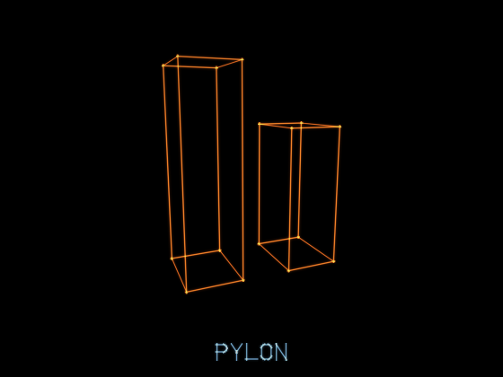 | `pylon` | A column up from the floor. 1–3 per obstacle, 22–52 wide, up to the rim |
| 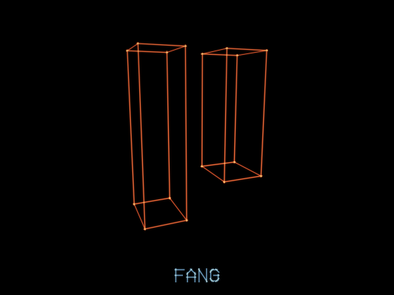 | `fang` | The same thing hanging from the roof, pointing down |
| 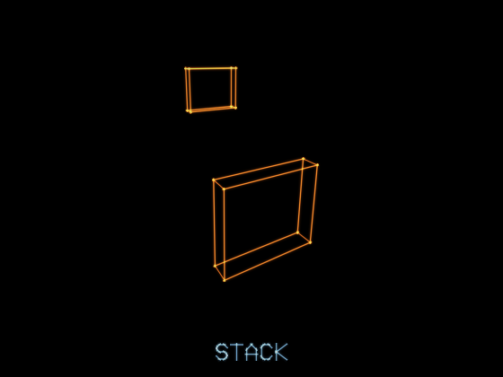 | `stack` | Staggered half-blocks, alternating high and low, 300 units apart — a chicane, not a coin flip |
| 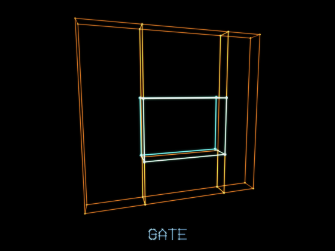 | `gate` | A wall with one window in it. The window is drawn bright and the blocks are dim, because the gap is the information |

### Posture

These want the ship held a particular way. `slot` alternates between the two
forms as a level places them, so the roll is a conversation rather than a trick.

The room in a slit is `slotgap` (2–14, default **4**), measured each side of the
ship's own footprint rather than as an absolute width — so the field says the
thing that matters. Four is also the ceiling that keeps a slot a slot: an
upright slit has to stay narrower than the 14 the ship is wide flying level, and
half of (14 − 5) is 4.5. Ask for more and it becomes an ordinary window that
does not need the roll at all.

| | Kind | What it is |
| --- | --- | --- |
| 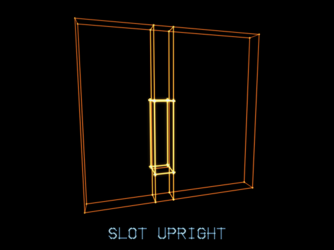 | `slot` upright | A slit **13** units wide against a ship that is 5 wide on edge and 14 wide level: it only takes the ship **on edge**, with 4 units of room each side |
| 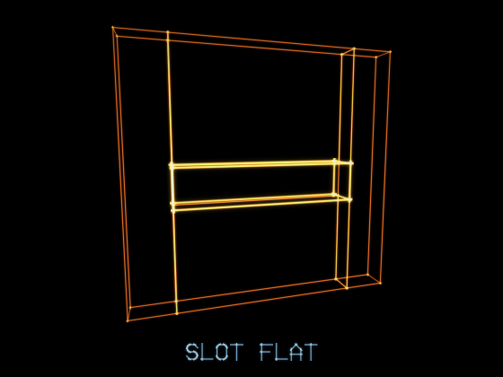 | `slot` flat | A slit **18** units tall against a ship 10 tall level and 18 on edge: it only takes the ship **level**, with 4 units above and below |
| 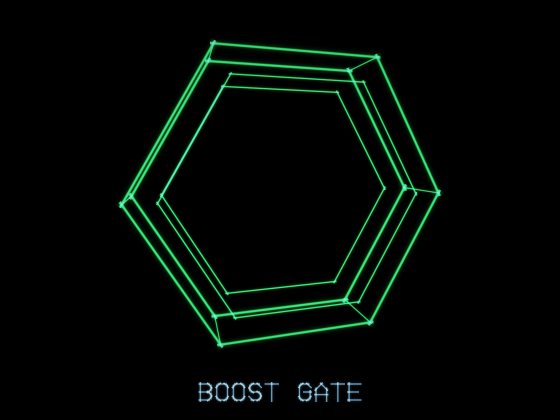 | `boostgate` | Green, hexagonal, and the only thing out here that helps. Fly through the hoop for +150 and **three seconds of speed**, on a stopwatch of its own: it does not spend the burn tank and does not fill it, so a gate is never wasted on a full one, and a second gate adds three more seconds to whatever is left. Take one while holding the burn as well and the two together make the super burn, 2.1×. Nothing about it is solid — the frame stops neither the ship nor a shot, and clipping it simply means you did not go through |

### Moving

Drawn cool blue, so at a glance you can tell what will still be there when you
arrive.

| | Kind | What it is |
| --- | --- | --- |
| 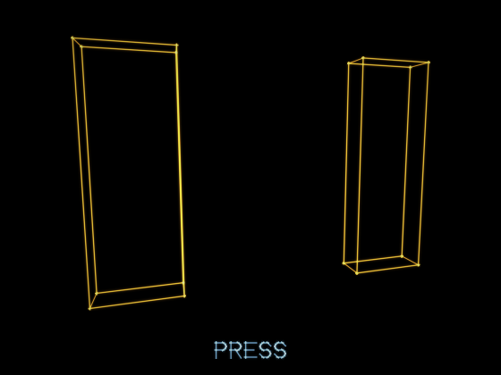 | `press` | Two walls closing on the centre and opening again at 0.85–1.35 rad/s — a 4.6 to 7.4 second cycle. The gap never shuts past 26 units: a crusher with no opening is just a wall that arrives late |
| 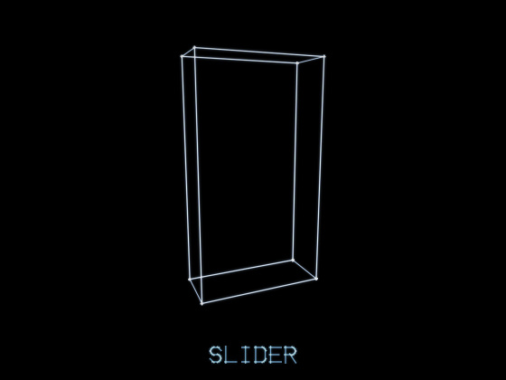 | `slider` | A block tracking side to side at 0.8–1.5 rad/s, or (40% of the time) up and down |
| 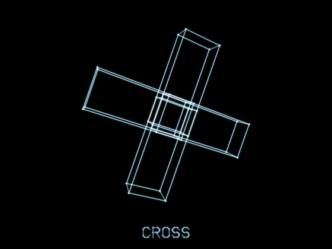 | `cross` | Four thick arms from the middle of the trench, turning at 0.5–1.2 rad/s |
| 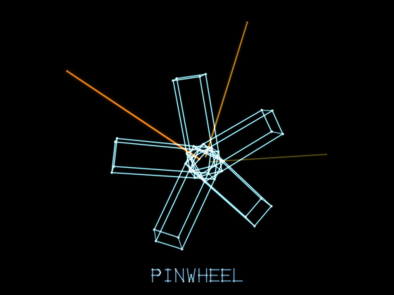 | `pinwheel` | The same idea thinner: three or five arms, turning. Geometry, not a gun |

### The two that fight back


| | Kind | What it is |
| --- | --- | --- |
| 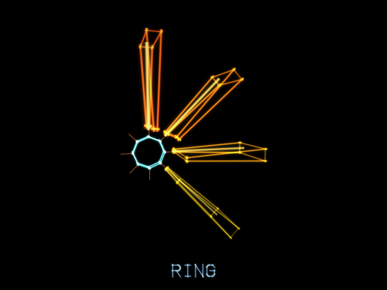 | `ring` | An iris: a hole in a plate, radius 28–40, with **eight orange tentacles** standing off the rim — and they fire. One after another clockwise from twelve, `ringrate` seconds apart (default **0.2**), each throwing a wedge of light outward at the rock that fades orange to yellow. Four always stand at once — a beam's life is derived from that ring's own rate — so slowing a ring slows the sweep going round rather than thinning the wall. They are a hazard to fly *through*, not a gun that aims: the hole stays clean, and beams stand 90 units in front of the hoop so cutting the corner on the way in costs 20. Flying the hole properly costs nothing — measured across all 21 rings in the shipped levels |
| 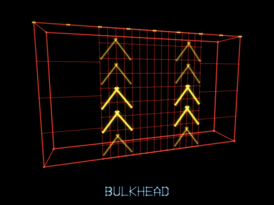 | `seal` | A bulkhead: a full wall across the trench, hatched dense so it cannot read as a tunnel, with chevrons climbing it saying **up**. Not in `kinds` — authored by count with `seals` (0–6), one per 2600 units of section, and it pulls a gatling, a battery and 3–5 turrets to the surface above it. 48 damage if you hit it. The other way through is its [panels](#panel--panel) |

---

## Adding one

The `kind` string is the spine. A new enemy needs a branch in each of four
places, and nothing else:

| File | What to add |
| --- | --- |
| [`level.js`](../src/level.js) | Where it is placed, and its `enemy()` overrides |
| [`game.js`](../src/game.js) | Its firing routine in `updateEnemies`, and a `RADIUS` entry |
| [`entities.js`](../src/entities.js) | Its shape, as a branch in `drawEnemies` |
| [`spec.js`](../src/spec.js) | A density field in `FIELDS`, if a level should be able to ask for it |

Then add it to `SUBJECTS` in [`tools/portraits.mjs`](../tools/portraits.mjs) and
re-run it, and it has a portrait in here too.

`node tools/doccheck.mjs` reads the constants out of the source and checks this
file still quotes them, that every enemy's hit points match, and that every
obstacle kind and spec field is written down somewhere. It exits non-zero when
they are not, so a number that moves without its documentation is a failure
rather than something somebody has to spot.
